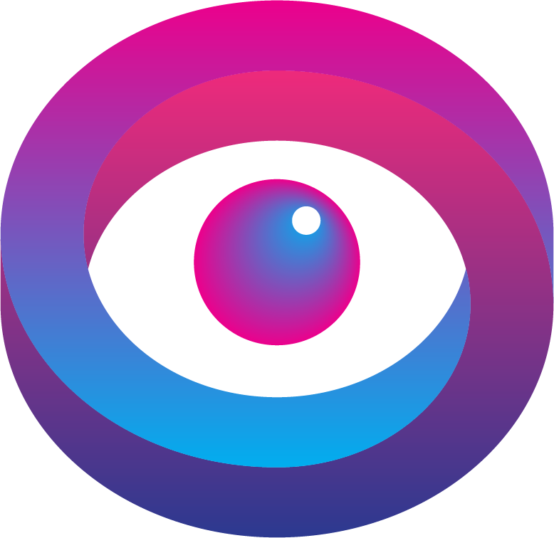

# REFLECT



Reflect is an augmented reality application which is designed and developed by Durham College students under the guidance of experienced professors.

Credits to Founding Contributors:
Students: Dana Carroll, Simran Garcha, Heather Grandovec, Jiahua Cui
Professors: Linda Chen, Stuart Sackler

# Instruction

Git setup

Add remote origin by using

```bash
git remote add origin https://github.com/JiCui1/DC-MAD-AR.git
```

Clone git repository by using

```bash
git clone https://github.com/JiCui1/DC-MAD-AR.git
```

Fetch branch by using

```bash
git fetch --all or git fetch <branch name>
```

Pull from development branch by using

```bash
git pull origin development
```

Push to development branch by using

```bash
git push origin development
```

Create your own branch for the part you are working on then merge with development branch.

# How to test

Make sure to have node installed

Open terminal

Install dependencies

```bash
npm install
```

Start app with

```bash
node app
```

test url - localhost:3000
if port 3000 is already in use, find the following code in app.js and change to any other port

```bash
    app.listen(3000)
```

# Dependency

mongoose: mongoDB framework to make CRUD operation

express: node js framework

ejs: view engine to output data from DB to front end

multer: middleware to upload file to folder

uuid: module to generate unique id

fs: file system, module to navigate and control files in directory

image descriptor maker modules: (glob, imagemagic, inkjet, jepg-js, pngjs, readline-sync)

# Project Structure

MERN stack and MVC structure are used for the platform. Make sure to have a basic understanding before working on the project.

Models, Views, Controllers: MVC structure

Partials: Folder to hold resuable code like html head

Public: Place to store express static information like css file/assets folder for ejs to get access

libs: js libraries

modules: separate js function

# AR.js

AR.js is library used to create the AR experience.
You can find their documentation here: https://ar-js-org.github.io/AR.js-Docs/

Aframe(Web VR/AR library) tags are used for the project
You can find their documentation here: https://aframe.io/docs/1.2.0/introduction/
