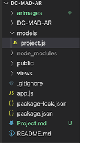

#    REFLECT


Link to try the application ~ https://---


___

Reflect is an augmented reality application which is designed and developed by Durham College students under the guidance of experienced professors. 

Reflect works with 
* Marker 
* Image Tracing 
* GPS Tracking 
* Video 

# Instruction

Add remote origin by using

```bash
git remote add origin https://github.com/JiCui1/DC-MAD-AR.git
```

Fetch branch by using

```bash
git fetch --all or git fetch <branch name>
```

Pull from development branch by using

```bash
git pull origin development
```

Push to development branch by using

```bash
git push origin development
```

# How to test

* Open **Terminal** in a Code Editor.
* Start app with
   * ```bash 
      node app
   * app is the main file which contains all the functionality to start the application.

* Test URL  
   * ```bash 
      localhost:3000/projects/<project id>
   *  Localhost can be changed in the app.js file to any other value for localhost. 
      ```bash 
         app.listen(3000)
       ```
   * Replace < project id > with the actual id of project which you can find in localhost:3000/projects.
 

# Dependency

**mongoose:** MongoDB framework to make CRUD operation

**express:** node js framework

**ejs:** view engine to output data from DB to front end

**multer:** middleware to upload file to folder

# Project Structure

Public: Place to store express static information like css file/assets folder for ejs to get access

Views: ejs files to for node js to render to front end

Partials: Folder to hold resuable code like html head


# Linking library and stylesheets

In order to link the stylesheet and libraries in the application you will either need to install it by the node library or add a link in the file **head.ejs** located  : 
```bash 
 Views > Partials > head.ejs
```

All the scripting links for **AR.js** and **A-frame** are located in the file **headscript.ejs**  located :
```bash 
 Views > Partials > headscript.ejs
```


# For Developers  

**Database**
* MongoDB is the database which is being used which is being connected via mongoose .
* Mongoose Schema can be found 
   * In the folder  **models > project.js** 
    
   * It is being exported by the name **Project**


**App.js**

It contains 
* URI to MongoDB Database
* Routes to all the pages are assigned here.
* File path of where the assets are stored.
* Submission of data to the database.
* Function to find the project by a specific id.
```bash
app.get('/projects/:id',(req,res)
```

* Function to add mutliple assets to one trigger 
```bash
app.post('/projects/:id/add',multipleUpload,(req,res)
```
* Function to edit the project that has already been created.
```bash
app.post('/projects/:id/:trigger/edit',(req,res)
```

* Function to delete the trigger added individually and then updating those changes and saving them .
```bash
app.put('/projects/:id/:trigger/delete',(req,res)
```

* Function to delete the assets from the assets folder as well as the deleting the project from the database
```bash
app.delete('/projects/:id',(req,res)
```

**Details.ejs**
```bash
In folder Views - details.ejs
```

* Showing and Hiding particular input form according to what method has been chosen . 
* Function to show input field for trigger's once **Add Trigger** button is clicked.
* Function to **Delete Triggers**


**Create.ejs**

```bash
In folder Views - create.ejs
```
* This is where the user can add more options while creating a project.
* Additional methods of creating and input can be added here.

**Assets**

All the assests are stored in two locations - 
* In Database
* Public > Assets


**Stylesheet**

Location of the stylesheet 
* public > stylesheet > style.css


# AR 

AR.js is being used to create an AR experiance for the users. All the files regarding AR is in folder **Views**.

**marker-model.ejs**

This is the file in the **Views** folder which contains the AR code to detect a marker and show an image or a video according to which asset has been uploaded.

* Contains option for changing : 
   * Position
   * Rotation 
   * Scale 
of the Image
*  The Marker that is used to detect the asset can be changed by specifying in the code : 
```bash 
<a-marker preset="hiro"> 
```


**video.ejs**

This is where the video asset settings can be changed and a particular marker can be selected for the video asset.


**gps.ejs**
This file contains the setting for the gps which includes the latitude and longitude input. 

